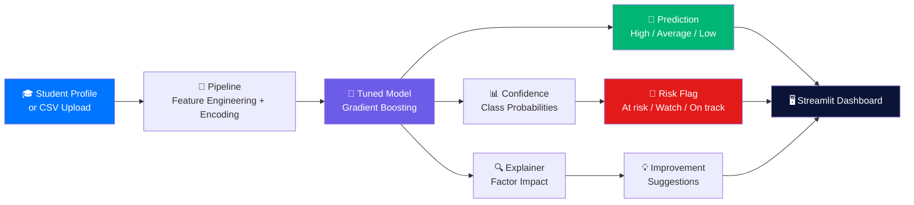

<div align="center">


### Predict whether a student will land High, Average or Low, see exactly why, and know what to fix.

[](https://git.io/typing-svg)

<br/>

[](https://www.python.org/)
[](https://scikit-learn.org/)
[](https://streamlit.io/)
[](https://plotly.com/)
[](#-author)

<br/>

[](https://YOUR-APP-LINK.streamlit.app)

<br/>

[](https://github.com/shubhmohan)
[](https://github.com/shubhmohan)
[](https://github.com/shubhmohan/student-performance-classifier/stargazers)

<br/>

**Built by [@shubhmohan](https://github.com/shubhmohan)**

</div>

---

## 📚 Table of Contents

- [The Problem](#-the-problem)
- [What It Does](#-what-it-does)
- [Architecture](#-architecture)
- [Tech Stack](#-tech-stack)
- [Dataset](#-dataset)
- [Model & Approach](#-model--approach)
- [Results](#-results)
- [Explainability](#-explainability)
- [Project Structure](#-project-structure)
- [Setup](#-setup)
- [Challenges & How I Solved Them](#-challenges--how-i-solved-them)
- [Why This Matters](#-why-this-matters)
- [Known Limitations](#-known-limitations--next-steps)
- [Author](#-author)

---

## 🔥 The Problem

Students usually get help **after** the final result is already bad. By then the grades are locked in, and teachers rarely have time to read through every student's profile to spot who is slipping.

That means:
- 📉 Struggling students are noticed too late
- 🤷 "Why is this student at risk?" has no clear answer
- 🧭 Advice is generic instead of based on the student's weakest factors

**This project turns a student's profile into an instant prediction, a clear explanation, and a short list of concrete next steps.**

---

## ⚡ What It Does

<table>
<tr><td>1️⃣</td><td><b>Predicts</b> — classifies a student as <code>High</code>, <code>Average</code> or <code>Low</code> performing, with a confidence score and the probability of every class</td></tr>
<tr><td>2️⃣</td><td><b>Explains</b> — shows the factors that pushed this student's prediction up or down, compared with a typical student</td></tr>
<tr><td>3️⃣</td><td><b>Flags risk</b> — marks each student as <code>At risk</code>, <code>Watch</code> or <code>On track</code></td></tr>
<tr><td>4️⃣</td><td><b>Advises</b> — generates improvement suggestions from the weakest factors, ordered by their impact</td></tr>
<tr><td>5️⃣</td><td><b>Simulates</b> — a what-if panel re-runs the prediction as you change study time, absences, failures or weekend alcohol use</td></tr>
<tr><td>6️⃣</td><td><b>Scales</b> — upload a CSV to analyse many students at once, filter by risk, and download the results</td></tr>
<tr><td>7️⃣</td><td><b>Reports</b> — a model report tab with the confusion matrix, feature importance and model comparison</td></tr>
</table>

---

## 🏗️ Architecture



*(This diagram renders live and zoomable directly on GitHub, so no image is needed.)*

---

## 🧰 Tech Stack

| Layer | Tool |
|---|---|
| 🐍 Language | Python 3.12 |
| 🧮 Data | Pandas, NumPy |
| 🤖 Machine learning | scikit-learn (Pipeline, ColumnTransformer, RandomizedSearchCV, Gradient Boosting, Random Forest, Logistic Regression) |
| 📊 Charts | Plotly |
| 🖥️ Interface | Streamlit with a custom dark glass theme |
| 💾 Model storage | joblib |

---

## 📦 Dataset

**[UCI Student Performance](https://archive.ics.uci.edu/dataset/320/student+performance)** (Cortez & Silva, 2008)

- **1,044 students** from two Portuguese secondary schools (395 Math + 649 Portuguese records)
- **30+ attributes:** study time, past failures, absences, parents' education and jobs, family support, internet access, going out, alcohol use, health, and the term grades
- **Target:** built from the final grade `G3` (0 to 20)

| Class | Final grade (G3) |
|---|---|
| 🔴 Low | 0 – 9 |
| 🟠 Average | 10 – 14 |
| 🟢 High | 15 – 20 |

`train.py` downloads the data automatically. If your network blocks it, download the zip from the link above and place `student-mat.csv` and `student-por.csv` inside `data/`.

---

## 🧠 Model & Approach

1. **Target creation** — `G3` is binned into three classes. The Math and Portuguese files are merged, with `subject` kept as a feature.
2. **Prior grades as inputs** — the term 1 and term 2 grades (`G1`, `G2`) are used because they are known before the final grade. A separate baseline without them is also reported, so the effect is visible.
3. **Feature engineering (inside the pipeline)** — average term grade, grade trend (`G2 − G1`), and total alcohol use.
4. **Preprocessing** — `ColumnTransformer` with scaling for numeric columns and one-hot encoding for categorical ones, all inside one `Pipeline` so training and prediction use identical steps.
5. **Model selection** — Logistic Regression, Random Forest and Gradient Boosting, each tuned with `RandomizedSearchCV` (stratified 5-fold CV), plus a soft-voting ensemble of the three. The best model is chosen by **macro-F1**, because accuracy alone hides weak performance on the rarer classes.
6. **Evaluation** — stratified 80/20 hold-out set, confusion matrix, accuracy and macro-F1.

---

## 📈 Results

| Model | CV macro-F1 (5-fold, train split) |
|---|---|
| 🏆 Gradient Boosting (selected) | **0.890** |
| Random Forest | 0.889 |
| Ensemble (soft vote) | 0.881 |
| Logistic Regression | 0.850 |

**Held-out test set (20%, stratified):**

| Metric | Score |
|---|---|
| Accuracy | **0.871** |
| Macro-F1 | **0.854** |
| Accuracy without term grades (habits and background only) | 0.641 |

The last row shows how much prior grades matter: background and habits alone are a much weaker signal than a student's academic record.

---

## 🔍 Explainability

Two levels of explanation are built in, both at the level of the original columns so they stay readable:

- **Overall importance** — permutation importance on macro-F1 shows which factors matter across the whole model.
- **Per-student factors** — *occlusion*: each feature is reset to the typical value, and the drop in the predicted class probability is that feature's effect. Green bars support the predicted class, red bars pull away from it.

**Risk logic**

| Status | Rule |
|---|---|
| 🔴 At risk | Predicted `Low`, or P(Low) ≥ 50% |
| 🟠 Watch | P(Low) ≥ 25% |
| 🟢 On track | Everything else |

**Improvement suggestions** come from interpretable rules (low term grades, low study time, past failures, high absences, heavy alcohol use, and similar) and are ordered by how strongly each factor affected the prediction.

---

## 📁 Project Structure

```
student-performance-classifier/
├── app.py                 # Streamlit dashboard (Dashboard, Batch analysis, Model report)
├── train.py               # Downloads data, tunes models, saves the best one
├── src/
│   ├── __init__.py
│   └── core.py            # Data, training, prediction, explanation, advice
├── .streamlit/
│   └── config.toml        # Dark theme settings
├── data/                  # UCI CSVs (downloaded by train.py)
├── models/                # Saved pipeline (created by train.py)
├── requirements.txt
└── README.md
```

---

## 🛠️ Setup

<details>
<summary><b>Click to expand setup instructions</b> 👇</summary>

<br/>

**Prerequisites:** Python 3.10+ and `pip`.

```bash
git clone https://github.com/shubhmohan/student-performance-classifier.git
cd student-performance-classifier

python -m venv .venv
source .venv/bin/activate        # Windows: .venv\Scripts\activate

pip install -r requirements.txt
python train.py                  # takes a few minutes: downloads data, tunes and saves the model
streamlit run app.py
```

The app opens at `http://localhost:8501`.

**Batch mode:** open the *Batch analysis* page, download the CSV template, fill in your students, and upload it. Missing columns are filled with typical values.

</details>

---

## 🧗 Challenges & How I Solved Them

<details>
<summary><b>📉 Low accuracy at first (≈52%)</b> — click to expand</summary>

<br/>

My first version excluded the term grades to avoid leakage, and habits and background alone only reached about 52% on three classes. I added the term 1 and 2 grades as inputs (they are known before the final grade), engineered features such as grade trend, tuned three model families, and kept the no-grades model as a baseline. Test accuracy rose to **87.1%**, and the baseline itself improved to 64.1%.

</details>

<details>
<summary><b>⚖️ Class imbalance</b> — click to expand</summary>

<br/>

The High class is the smallest. I used stratified splits, class weights where supported, and **macro-F1** (not accuracy) for model selection so a model can't win by ignoring the rare class.

</details>

<details>
<summary><b>🧩 Explaining a pipeline model</b> — click to expand</summary>

<br/>

One-hot encoding hides the original columns, which makes importances unreadable. I explained at the raw-feature level (permutation importance and occlusion), so every chart uses labels like "Absences" and "Study time".

</details>

<details>
<summary><b>🗂️ Messy CSV uploads</b> — click to expand</summary>

<br/>

Missing columns are filled with typical values, numeric columns are coerced, and unreadable files show a clear error with a link to the template instead of crashing.

</details>

<details>
<summary><b>⏱️ Slow first launch</b> — click to expand</summary>

<br/>

Tuning takes a few minutes, so the trained model is saved with joblib and loaded instantly. If no saved model exists, the app trains once on first launch and shows a spinner.

</details>

---

## 💡 Why This Matters

- 🧑‍🏫 **Teachers** — an early-warning view of who needs help before the final grade, with reasons instead of a bare score
- 🎓 **Students** — concrete, personal suggestions rather than generic study advice
- 🏫 **Institutions** — batch analysis to see risk across a whole class in seconds
- 🧪 **As a demonstration** — a complete ML workflow (data, leakage-aware features, tuned models, evaluation, explainability, deployment) in one project

---

## 🔭 Known Limitations & Next Steps

<details>
<summary>Click to expand</summary>

- The data covers two schools in one country, so predictions may not transfer to other settings; the output is a prompt for support, not a verdict on a student
- Many students appear in both the Math and Portuguese files, so a random split can place the same student in train and test; a grouped split would give a stricter estimate
- The test set is about 209 students, so one student moves accuracy by roughly half a percent; the cross-validated score is the steadier number
- Improvement suggestions are rule-based, not learned
- Next steps: grouped cross-validation, SHAP explanations, probability calibration, and a trend view across terms

</details>

---

## 👤 Author

<div align="center">

**Built by [@shubhmohan](https://github.com/shubhmohan)**

[](https://github.com/shubhmohan)
[](https://linkedin.com/in/shubhmohan)

⭐ **If this project helped you, consider giving it a star!** ⭐

</div>